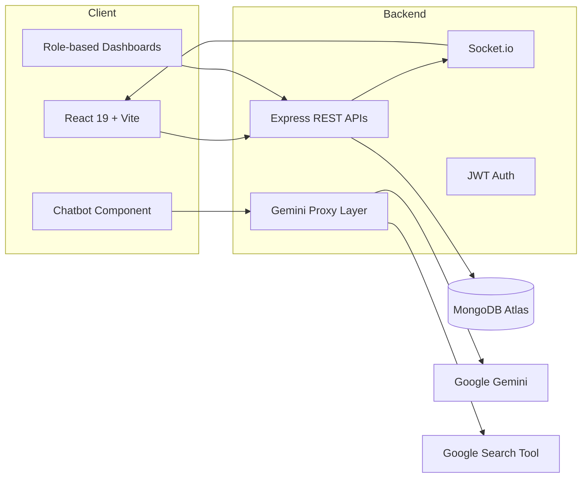

<div align="center">
  
</div>

# MARG AI — Pitch Deck

## 1. Vision & Mission
- **Vision**: Empower every Indian student with personalized mentorship, actionable academic guidance, and real-time opportunities.
- **Mission**: Combine conversational AI, curated resources, and mentor networks to help students discover, plan, and achieve meaningful careers.

## 2. The Problem
- **Students lack access to personalized mentoring**, especially in Tier 2/3 cities.
- **Information overload** makes it difficult to track exams, admissions, scholarships, and deadlines.
- **Parents and teachers struggle to guide students** with up-to-date, holistic advice across diverse career paths.

## 3. Our Solution
- **AI Mentor Chatbot**: Answers questions, offers guidance, and navigates the platform conversationally.
- **Career Explorer & Quiz Engine**: Provides structured recommendations based on student preferences and aptitude.
- **Real-Time News & Alerts**: Fetches the latest updates on exams, admissions, scholarships, and resources using live search.
- **Mentor Marketplace**: Connects students with verified mentors for deeper guidance.

## 4. Product Highlights
1. **Conversational Career Guide**
   - Gemini-powered assistant trained with platform-specific instructions.
   - Smart navigation prompts for seamless in-app journeys.
2. **Personalized Career Paths**
   - AI-generated reports including curated college shortlists and resources.
   - Insights tailored to the student’s stage, city, and quiz outcomes.
3. **Opportunity Radar**
   - Live scraped news encoded into standardized categories (EXAM, ADMISSION, SCHOLARSHIP, DEADLINE, RESOURCE).
   - Timestamped alerts designed for quick comprehension.
4. **Mentor & Session Management**
   - Role-based dashboards for students, parents, teachers, and admins.
   - Calendared sessions, resource sharing, and progress tracking.

## 5. Target Users & Market
- **Primary**: Students aged 13–22 exploring academic and career choices.
- **Secondary**: Parents, teachers, coaching centers, and career counselors.
- **Market**: India's $2.8B ed-tech guidance and counseling segment, growing at ~14% CAGR.

## 6. Business Model
- **Freemium Access**: Chatbot, news updates, and basic career exploration are free.
- **Subscription Tiers**: Premium quizzes, detailed reports, and curated college Apply Packs.
- **Marketplace Fees**: Commission on paid mentor sessions and partner services.
- **Institution Partnerships**: Branded dashboards and analytics for schools and coaching networks.

## 7. Competitive Advantage
- **Real-Time Intelligence** via Gemini + Google Search integration.
- **Localized Recommendations** using Indian-centric datasets and flexible matching logic.
- **Multi-Stakeholder Experience** with tailored dashboards for each persona.
- **API-First Architecture** enabling integrations with schools and ed-tech partners.

## 8. Traction & Validation
- **AI Studio prototype** live: https://ai.studio/apps/drive/1KAH1L83W3w_j2Bw6X2JlbSjtjd9xVZBw
- **MVP features completed**: Auth, mentor management, session scheduling, AI-powered recommendations, real-time news feed.
- **Pilot-ready backend** with Express.js, MongoDB, and Socket.io for real-time collaboration.

## 9. Go-To-Market Strategy
1. **Pilot Programs** with schools and coaching institutes.
2. **Campus Ambassador Network** to drive student adoption.
3. **Content Marketing & Webinars** on exam prep, scholarships, and career pathways.
4. **Strategic Partnerships** with ed-tech platforms and financial institutions offering education loans or test-prep resources.

## 10. Financial Outlook & Ask
- **Projected Year 1 Revenue**: ₹35–40 lakh from subscriptions and mentor sessions (pilot cohorts).
- **Investment Ask**: $250K seed to expand engineering, onboard mentors, and scale marketing.
- **Use of Funds**:
  1. 35% product & data enhancements.
  2. 30% mentor acquisition and training.
  3. 20% marketing and growth pilots.
  4. 15% compliance, operations, and contingency.

## 11. Roadmap
1. **Q1 2025**
   - Launch student & parent dashboards.
   - Add multilingual chatbot support (Hindi, Marathi, Tamil).
2. **Q2 2025**
   - Integrate calendar sync, reminders, and mentor ratings.
   - Expand college data with verified fee + placement info.
3. **Q3 2025**
   - Release AI-powered application essay assistant.
   - Deploy analytics dashboard for schools.
4. **Q4 2025**
   - Introduce adaptive learning paths and scholarship prediction.
   - Begin expansion into Southeast Asian markets.

## 12. Technology Stack
- **Frontend**: React 19 + Vite, TypeScript, Tailwind configuration, import maps for optimized CDN loading.
- **Backend**: Node.js, Express.js, MongoDB Atlas, Socket.io, custom middleware.
- **AI & Integrations**: Google Gemini (`@google/genai`), dynamic Google Search tool calls, JWT authentication, real-time notifications.

## 13. Architecture Overview


## 14. Team & Advisors
- **Founding Team**: Product strategist, AI engineer, and educator with 15+ years combined ed-tech experience.
- **Advisors**: Former principals, industry mentors, and data scientists guiding personalization strategy.

## 15. Social Impact & ESG
- **Access & Equity**: Subsidized plans for government school students.
- **Inclusion**: Regional language support and accessibility-first UI principles.
- **Data Ethics**: Strict PII handling, transparent AI explanations, and opt-in telemetry.

## 16. Call to Action
- **Students & Parents**: Sign up for early access, explore curated career paths, and book mentor sessions.
- **Mentors & Institutions**: Partner with MARG AI to reach motivated learners.
- **Investors & Advisors**: Connect with us to accelerate equitable career guidance across India.

## 17. Getting Started Locally

### Prerequisites
- **Node.js 18+** (LTS recommended)

### Backend Setup
1. Install dependencies:
   ```bash
   npm install
   ```
2. Set environment variables in `backend/.env` (MongoDB URI, JWT secret, Gemini key if required for server utilities).
3. Start the backend:
   ```bash
   npm run dev
   ```

### Frontend Setup
1. Navigate to the frontend directory:
   ```bash
   cd frontend
   ```
2. Install dependencies:
   ```bash
   npm install
   ```
3. Configure the Gemini key by creating `frontend/.env.local` (or `.env`) with:
   ```bash
   VITE_GEMINI_API_KEY=your_real_gemini_key
   ```
4. Run the development server:
   ```bash
   npm run dev
   ```
5. Open the provided local URL (default `http://localhost:5173`) in your browser.

### Testing Real-Time Features
1. Ensure both frontend and backend servers are running.
2. Open multiple browser tabs to observe Socket.io chat interactions.
3. Trigger the news feed to validate live Google Search responses (requires valid Gemini key).

## 18. Security & Privacy Notes
- **Environment Keys**: Never commit real API keys. Use `.env.local` for local development and configured secrets in deployment environments.
- **Data Storage**: User profiles, sessions, and mentor data reside in MongoDB with role-based access controls.
- **Error Handling**: Centralized middleware logs server errors while returning sanitized messages.

## 19. Contact
- **Email**: founders@marg-ai.in
- **LinkedIn**: https://linkedin.com/company/marg-ai
- **Demo Booking**: Schedule a walkthrough via calendly.com/marg-ai

---

<div align="center">
  <strong>Together, lets build personalized futures for every student.</strong>
</div>
